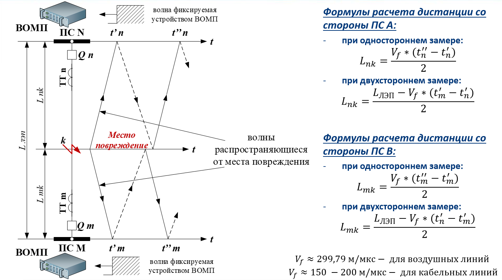
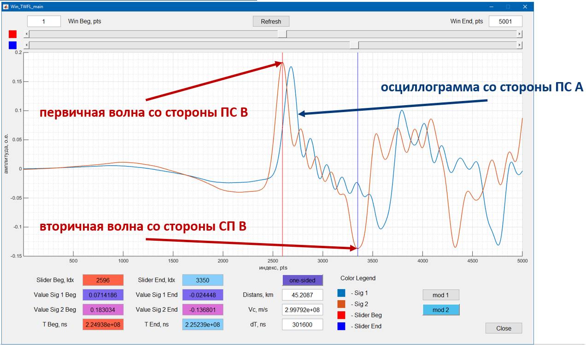
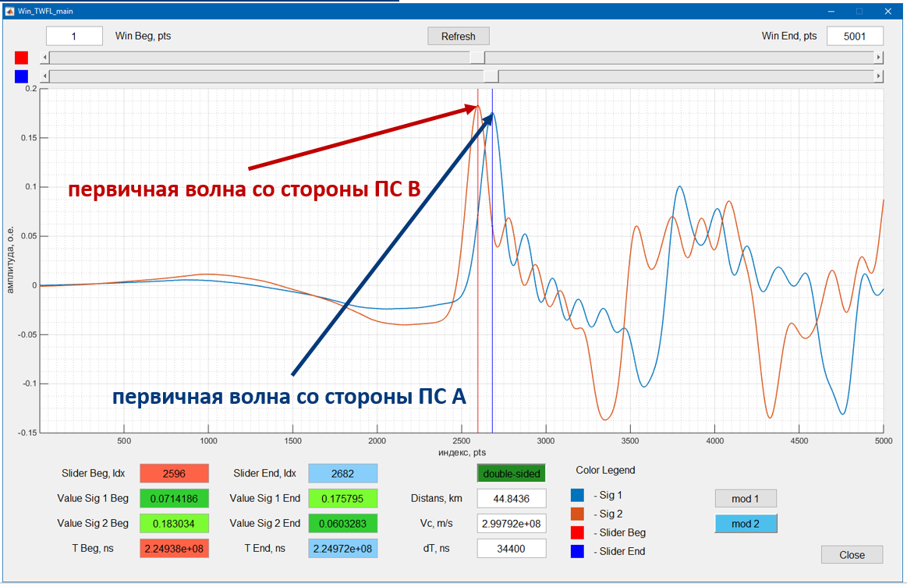

# 
 Mt TWFL algorithm

Traveling wave fault location (TWFL) - волновой метод определения места повреждения на высоковольтных линиях электропередачи.

## Перечень технологий

MATLAB-2018b

## Описание

Волновой метод двухстороннего ОМП основан на фиксации времени прихода первичных волн, возникших в месте повреждения, полукомплектами, установленными по концам линии электропередачи.

## Материалы

- [Модель длинной линии электропередачи](src/longline/README.md);
- [презентация](presentation.pdf);
- [доклад](report.pdf);
- [пояснительная записка](note.pdf).

## Особенности
- рассмотрена и добавлена поддержка учета неоднородных линий электропередач при реализации алгоритма ВОМП;
- рассмотрена возможность использования алгоритма идентификации электрических параметров линии (R, L, C, G) до аварийного режима работы для определения скоростей распространения ЭМ волн в проводах ЛЭП;
- эскиз интерфейса программы для просмотра осциллограмм и ручного определения места повреждения (метод основанный на одностороннем замере / фиксации);

- эскиз интерфейса программы для просмотра осциллограмм и ручного определения места повреждения (метод основанный на двухстороннем замере/ фиксации);

